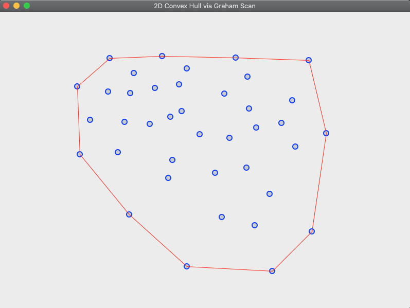

# Graham Scan Visualization

This is a little side project that I thought would be a good intro into writing GUIs in C++. The inspiration for visualizing this particular algorithm was a talk that I went to where someone said they were asked an interview question for finding the convex hull. I sort of took it and ran with it from there.

Here is an image of the GUI:
 

## Usage

If you wish to run this on your machine, I would suggest first installing wxWidgets. I used brew on my Mac and used the following command:

```shell
brew install wxwidgets
```

Then, from the directory that you cloned this from, run

```shell
make app && ./app
```

The header files will likely be in your <b>/usr/local/include/</b> folder if you are on a mac.

If you choose to run the GUI, the commands are as follows:

Left mouse click - places a point on the window
`r' key - will reset the window (i.e. clear it)
`h' key - will calculate the hull

I have separated the GUI from the data as much as possible. The GrahamScan class can be used as a standalong class in another context. This is actually what enabled me to do unit testing. I tried doing unit testing using the Catch2 framework, but things did not go so well. So I wrote some manual tests.

Using the GrahamScan class is simple.

```cpp

#include "graham_scan.hpp"
// this include is not strictly necessary as it is in the prev. header
#include <vector> 

int 
main(void)
{
    // create instance of GrahamScan
    GrahamScan g;
    
    // create a point to add
    Point p1 = { 12, 13 };
    Point p2 = { 14, 15 };
    Point p3 = { 11, 23 };
    Point p3 = { -9, 44 };

    // need at least 3 points for the hull
    g.addPoint(p1);
    g.addPoint(p2);
    g.addPoint(p3);
    g.addPoint(p4);

    // find the hull
    g.findHull();

    // get the gull
    std::vector<Point> hull = g.getHull();
    
    /* do stuff with the hull you found */
    
    // clear the scan (could add new set of points or something else)
    g.clear();

    return 0;
}
```

My visualization is essentially a wrapper for this functionality :D

## License
MIT License

Copyright (c) 2019 Anthony Turcios

Permission is hereby granted, free of charge, to any person obtaining a copy
of this software and associated documentation files (the "Software"), to deal
in the Software without restriction, including without limitation the rights
to use, copy, modify, merge, publish, distribute, sublicense, and/or sell
copies of the Software, and to permit persons to whom the Software is
furnished to do so, subject to the following conditions:

The above copyright notice and this permission notice shall be included in all
copies or substantial portions of the Software.

THE SOFTWARE IS PROVIDED "AS IS", WITHOUT WARRANTY OF ANY KIND, EXPRESS OR
IMPLIED, INCLUDING BUT NOT LIMITED TO THE WARRANTIES OF MERCHANTABILITY,
FITNESS FOR A PARTICULAR PURPOSE AND NONINFRINGEMENT. IN NO EVENT SHALL THE
AUTHORS OR COPYRIGHT HOLDERS BE LIABLE FOR ANY CLAIM, DAMAGES OR OTHER
LIABILITY, WHETHER IN AN ACTION OF CONTRACT, TORT OR OTHERWISE, ARISING FROM,
OUT OF OR IN CONNECTION WITH THE SOFTWARE OR THE USE OR OTHER DEALINGS IN THE
SOFTWARE.
